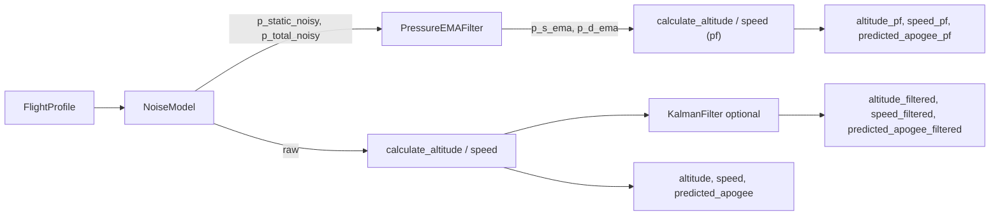

# Pressure-Domain EMA Filter

## Dlaczego EMA na ciśnieniu, a nie KF na ciśnieniu

Lag filtra wyrażony w Pa (zamiast m/s) nie przechodzi przez wzmocnienie `v²` w `predict_apogee`. Lag 1 Pa na ciśnieniu dynamicznym → ~0.003 m/s błędu prędkości → ~0.09 m błędu apogeum; vs lag 1 m/s prędkości po KF stanowym → ~27 m błędu. EMA jest wystarczające (KF na ciśnieniu z random-walk degeneruje się i tak do stałego wzmocnienia, równoważnego EMA).

## Przepływ danych




## Nowe i zmieniane pliki

### 1. Nowy: `src/filters/pressure_filter.py`

```python
class PressureEMAFilter:
    def __init__(self, tau_static=0.3, tau_dynamic=0.1): ...
    def configure(self, dt: float) -> None:
        # alpha_s = dt / (tau_static + dt)
        # alpha_d = dt / (tau_dynamic + dt)
    def reset(self) -> None: ...
    def update(self, p_static: float, p_dynamic: float) -> tuple[float, float]:
        # p_s_out = alpha_s * p_s + (1-alpha_s) * prev_s
        # p_d_out = alpha_d * p_d + (1-alpha_d) * prev_d
```

### 2. `src/filters/__init__.py`

Dodać eksport `PressureEMAFilter`.

### 3. `src/simulation/result.py`

Dodać opcjonalne pola:

```python
altitude_pf: np.ndarray | None = None
speed_pf: np.ndarray | None = None
predicted_apogee_pf: np.ndarray | None = None
pressure_filter_enabled: bool = False
pressure_filter_type: str = "none"
```

Rozszerzyć `to_dict()` i właściwości `max_altitude_pf`, `final_apogee_prediction_pf`.

### 4. `src/simulation/engine.py`

Dodać `pressure_filter=None` do `__init__`. W pętli, tuż po szumie:

```python
if pressure_filter_enabled:
    p_s_pf, p_d_pf = self.pressure_filter.update(p_static, p_diff)
    alt_pf  = calculate_altitude(p_s_pf, ...)
    spd_pf  = calculate_speed(p_d_pf, alt_pf, ...)
    apg_pf  = predict_apogee(spd_pf, alt_pf, ...)
    altitude_pf[i], speed_pf[i], predicted_apogee_pf[i] = alt_pf, spd_pf, apg_pf
```

`p_diff` liczymy z filtrowanych ciśnień dla kanału `_pf`; oryginalne `p_diff` (surowy) zostawia się dla kanału `altitude/speed`.

### 5. `src/api/schemas.py`

Nowa klasa:

```python
class PressureFilterConfigSchema(BaseModel):
    enabled: bool = False
    tau_static: float = 0.3   # [s]
    tau_dynamic: float = 0.1  # [s]
```

Dodać `pressure_filter_config: PressureFilterConfigSchema` do `SimulationRequest`.  
Dodać `altitude_pf`, `speed_pf`, `predicted_apogee_pf` (opcjonalne) do `SimulationResponse` i odpowiednie pola do `SimulationMetadata`.

### 6. `src/api/routes.py`

Nowy helper `_build_pressure_filter(request)`. Przekazanie do `SimulationEngine` i do `_build_mc_simulation_factory`. W `run_simulation` — wypakowanie `_pf` pól z `to_dict()` do response.

## Domyślne parametry

- `tau_static = 0.3 s` — ciśnienie statyczne zmienia się wolno; długa stała czasowa usuwa szum bez lag-u na prędkości
- `tau_dynamic = 0.1 s` — ciśnienie dynamiczne potrzebuje szybszej reakcji (szczytowa prędkość trwa krótko)

Oba można tuningować istniejącym skryptem `tune_kalman.py` po małej adaptacji.